<p align="center">
  
</p>

<h1 align="center">AxiomID: The Human Authorization Protocol</h1>

<p align="center">
  <strong>"In a world of noise, silence is rare. Are you human?"</strong>
</p>

<p align="center">
  <a href="https://nextjs.org/"></a>
  <a href="https://www.typescriptlang.org/"></a>
  <a href="https://tailwindcss.com/"></a>
  <a href="./LICENSE"></a>
  <a href="https://www.axiomid.app"></a>
</p>

<p align="center">
  <a href="https://www.axiomid.app">🌐 Live Demo</a> •
  <a href="#-architecture">📐 Architecture</a> •
  <a href="#-api-reference">🔌 API</a> •
  <a href="#-quick-start">🚀 Quick Start</a>
</p>

---

## 🌍 What is AxiomID?

**AxiomID** is a decentralized identity layer that proves **human intent** behind AI actions. It's not just a digital ID — it's **The Human Authorization Protocol** that bridges the gap between autonomous AI agents and accountable human principals.

<p align="center">
  
</p>

### 🔴 The Problem

| Challenge | Impact |
|-----------|--------|
| 🤖 **AI Content Flood** | The internet is drowning in synthetic content (Dead Internet Theory) |
| 🎭 **Deepfakes** | Impossible to verify if a person, post, or action is authentically human |
| 🏦 **Agent Economy** | AI agents execute real-world transactions without accountability |

### 🟢 The Solution

AxiomID provides a **"Stamp of Human Approval"** — a verifiable, on-chain badge that proves:

1. ✅ A **real human** exists behind an account
2. ✅ That human **authorized** specific AI actions  
3. ✅ The human has a measurable **"reputation density"**

---

## 🎭 Badge System

Our progressive verification creates a visual hierarchy of trust. Each level requires more proof, making identity fraud exponentially harder.

<p align="center">
  
</p>

| Level | Badge | Color | XP Required | What It Proves |
|-------|-------|-------|-------------|----------------|
| 0 | **Ghost** | `#4a4a4a` Grey | 0 | Email only — existence unverified |
| 1 | **Spark** | `#00ff41` Neon Green | 10-30 | Social presence (humans have friends) |
| 2 | **Pulse** | `#00d4ff` Electric Blue | 30-70 | Builder + financial history (humans create & transact) |
| 3 | **Axiom** | 🌈 Holographic | 70+ | Long-term stake + verified wallet (humans have skin in the game) |

### 🔗 Verification Integrations & XP Points

Each integration adds to your **Trust Score**. The harder something is to fake, the more points it's worth:

| Integration | XP | Why It Matters |
|-------------|-----|----------------|
| 📧 Email | +5 | Basic, but necessary |
| 𝕏 X (Twitter) | +10 | Social proof, public persona |
| 📘 Facebook | +10 | Real-name social graph |
| 📸 Instagram | +10 | Visual identity, photo history |
| 💬 Discord | +10 | Community engagement |
| 💼 LinkedIn | +15 | Professional identity, career history |
| 🐙 GitHub | +20 | **High value** — proves you build things |
| 💳 Coinbase Wallet | +15 | Financial identity |
| 🦊 MetaMask/Phantom | +15 | Web3 native identity |
| ⏳ Wallet Age (>6 months) | +50 | **Highest value** — time cannot be faked |
| 🔀 Wallet Diversity | +30 | Interacted with real protocols |
| 💰 Wallet Holdings (>$100) | +25 | Financial stake = accountability |
| 🌐 Domain Ownership | +20 | Owns digital real estate |

---

## 📐 Architecture

<p align="center">
  
</p>

### Data Flow

```mermaid
graph TD
    A[👤 User] --> B[Landing Page]
    B --> C{Trust Score Engine}
    C --> D[OAuth: X, Facebook, Instagram, GitHub, LinkedIn, Discord]
    C --> E[Web3Auth: Coinbase, MetaMask, Phantom]
    C --> F[Wallet Analyzer]
    F --> G[On-Chain History]
    C --> H[Badge Generator]
    H --> I[Dynamic SVG Badge]
    I --> J[🤖 AI Agents via API]
```



### Tech Stack

| Layer | Technology | Purpose |
|-------|------------|---------|
| **Frontend** | Next.js 15, Tailwind CSS, Framer Motion | Smooth Dark UX |
| **Auth** | NextAuth.js | OAuth for social platforms |
| **Web3** | Web3Auth, wagmi | Wallet connections |
| **Backend** | Cloudflare Workers | Edge API performance |
| **Database** | Cloudflare D1 / Supabase | User profiles & scores |
| **Blockchain** | Alchemy/Helius RPC | Wallet analysis |
| **Payments** | Stripe | Premium tier & API billing |

---

## 🔌 API Reference

### Verify a Human

Third-party AI agents and applications can verify if a wallet/user is human:

```bash
POST https://api.axiomid.app/v1/verify
Authorization: Bearer YOUR_API_KEY
Content-Type: application/json

{
  "wallet_address": "0x742d35Cc6634C0532925a3b844Bc9e7595f...",
  "required_level": "PULSE"
}
```

**Response:**

```json
{
  "is_verified": true,
  "humanity_score": 95,
  "level": "pulse",
  "level_name": "The Pulse",
  "badge_svg_url": "https://axiomid.app/badge/0x742d35.svg",
  "verified_at": "2026-02-09T21:00:00Z",
  "integrations": ["twitter", "github", "coinbase"]
}
```

### Pricing

| Tier | Audience | Cost |
|------|----------|------|
| **Free** | Individuals | Ghost → Pulse levels |
| **Premium** | Individuals | $9.99/year for Axiom badge |
| **API** | Developers | $0.01 per verification call |

---

## 🚀 Quick Start

### Prerequisites

- Node.js 20+
- npm or yarn
- (Optional) Alchemy/Helius API key for wallet analysis

### Installation

```bash
# 1. Clone the repository
git clone https://github.com/Moeabdelaziz007/axiomid-project.git
cd axiomid-project

# 2. Install dependencies
npm install

# 3. Set up environment variables
cp .env.example .env.local

# 4. Run development server
npm run dev
```

Open [http://localhost:3000](http://localhost:3000) — you should see the dark "Are you human?" landing page.

### Environment Variables

```env
# OAuth Providers
TWITTER_CLIENT_ID=
TWITTER_CLIENT_SECRET=
FACEBOOK_CLIENT_ID=
FACEBOOK_CLIENT_SECRET=
INSTAGRAM_CLIENT_ID=
INSTAGRAM_CLIENT_SECRET=
GITHUB_CLIENT_ID=
GITHUB_CLIENT_SECRET=
DISCORD_CLIENT_ID=
DISCORD_CLIENT_SECRET=
LINKEDIN_CLIENT_ID=
LINKEDIN_CLIENT_SECRET=

# Web3
NEXT_PUBLIC_WEB3AUTH_CLIENT_ID=
ALCHEMY_API_KEY=

# NextAuth
NEXTAUTH_SECRET=your-secret-key
NEXTAUTH_URL=http://localhost:3000
```

---

## 📁 Project Structure

```
axiomid/
├── src/
│   ├── app/
│   │   ├── page.tsx              # 🖤 Dark UX Landing
│   │   ├── layout.tsx            # Root layout
│   │   └── api/
│   │       ├── auth/[...nextauth]/ # OAuth handlers
│   │       └── v1/verify/          # Verification API
│   ├── components/
│   │   ├── Badge.tsx              # Dynamic SVG badge
│   │   ├── TypewriterText.tsx     # "Are you human?" effect
│   │   ├── GlitchButton.tsx       # Animated YES button
│   │   └── IntegrationList.tsx    # Connect accounts UI
│   └── lib/
│       ├── trustScore.ts          # XP calculation
│       └── walletAnalyzer.ts      # On-chain analysis
├── public/
│   ├── axiomid-banner.png
│   ├── badge-levels.png
│   └── architecture.png
└── package.json
```

---

## 🤝 Contributing

We welcome contributions from the community!

1. Fork the repository
2. Create a feature branch: `git checkout -b feature/amazing-feature`
3. Commit your changes: `git commit -m 'Add amazing feature'`
4. Push to the branch: `git push origin feature/amazing-feature`
5. Open a Pull Request

---

## 📜 License

MIT License © 2026 AxiomID

---

<br/>
<br/>

<div dir="rtl">

---

<h1 align="center">AxiomID: بروتوكول التفويض البشري</h1>

<p align="center">
  <strong>「في عالم مليء بالضجيج، الصمت نادر. هل أنت إنسان؟」</strong>
</p>

---

## 🌍 ما هو AxiomID؟

**AxiomID** هو طبقة هوية لامركزية تثبت **النية البشرية** خلف أفعال الذكاء الاصطناعي. ليس مجرد هوية رقمية — بل هو **بروتوكول التفويض البشري** الذي يربط بين وكلاء الذكاء الاصطناعي المستقلين والمسؤولين البشريين الحقيقيين.

<p align="center">
  
</p>

### 🔴 المشكلة

| التحدي | التأثير |
|--------|---------|
| 🤖 **طوفان محتوى الذكاء الاصطناعي** | الإنترنت يغرق في المحتوى الاصطناعي |
| 🎭 **التزييف العميق (Deepfakes)** | مستحيل التحقق من أصالة الإنسان |
| 🏦 **اقتصاد الوكلاء** | وكلاء AI ينفذون معاملات حقيقية بدون مساءلة |

### 🟢 الحل

يوفر AxiomID **"ختم الموافقة البشرية"** — شارة قابلة للتحقق تثبت:

1. ✅ أن هناك **إنساناً حقيقياً** خلف الحساب
2. ✅ أن هذا الإنسان **فوّض** أفعالاً محددة للـ AI
3. ✅ أن الإنسان لديه **"كثافة سمعة"** قابلة للقياس

---

## 🎭 نظام الشارات

<p align="center">
  
</p>

| المستوى | الشارة | اللون | النقاط | ماذا تثبت |
|---------|--------|-------|--------|-----------|
| 0 | **الشبح (Ghost)** | رمادي | 0 | بريد إلكتروني فقط — وجود غير مُثبت |
| 1 | **الشرارة (Spark)** | أخضر نيون | 10-30 | حضور اجتماعي (البشر لديهم أصدقاء) |
| 2 | **النبض (Pulse)** | أزرق كهربائي | 30-70 | بانٍ + تاريخ مالي (البشر يبنون ويتعاملون) |
| 3 | **البدهية (Axiom)** | هولوغرافي | 70+ | رصيد طويل المدى (البشر يخاطرون بأموالهم) |

### 🔗 التحققات ونقاط الثقة (XP)

| التكامل | النقاط | السبب |
|---------|--------|-------|
| 📧 البريد الإلكتروني | +5 | أساسي لكن ضروري |
| 𝕏 إكس (تويتر) | +10 | إثبات اجتماعي، شخصية عامة |
| 📘 فيسبوك | +10 | شبكة اجتماعية بالاسم الحقيقي |
| 📸 إنستغرام | +10 | هوية بصرية، تاريخ صور |
| 💬 ديسكورد | +10 | مشاركة مجتمعية |
| 💼 لينكد إن | +15 | هوية مهنية |
| 🐙 جيت هب | +20 | **عالي القيمة** — يثبت أنك تبني أشياء |
| 💳 محفظة كوينبيس | +15 | هوية مالية |
| 🦊 ميتاماسك/فانتوم | +15 | هوية ويب 3 |
| ⏳ عمر المحفظة (>6 أشهر) | +50 | **الأعلى قيمة** — الوقت لا يمكن تزويره |
| 🔀 تنوع المحفظة | +30 | تفاعل مع بروتوكولات حقيقية |
| 💰 رصيد المحفظة (>$100) | +25 | رصيد مالي = مسؤولية |

---

## 🚀 البدء السريع

```bash
# 1. استنساخ المستودع
git clone https://github.com/Moeabdelaziz007/axiomid-project.git
cd axiomid-project

# 2. تثبيت التبعيات
npm install

# 3. إعداد المتغيرات البيئية
cp .env.example .env.local

# 4. تشغيل خادم التطوير
npm run dev
```

افتح [http://localhost:3000](http://localhost:3000) لترى صفحة "هل أنت إنسان؟" المظلمة.

---

## 💼 نموذج العمل

| الطبقة | الجمهور | التكلفة |
|--------|---------|---------|
| **مجاني** | الأفراد | من Ghost إلى Pulse |
| **مميز** | الأفراد | $9.99/سنة لشارة Axiom |
| **API** | المطورين | $0.01 لكل طلب تحقق |

---

<p align="center">
  <strong>صُنع بـ ❤️ لمستقبل الإنسان والذكاء الاصطناعي</strong>
  <br/>
  <a href="https://www.axiomid.app">axiomid.app</a>
</p>

</div>
