<p align="center">
  
</p>

<h1 align="center">AxiomID: The Human Authorization Protocol</h1>

<p align="center">
  <em>Built by <a href="https://github.com/Moeabdelaziz007">Mohamed Abdelaziz</a> - AI Systems Architect & Founder</em>
</p>

<p align="center">
  <strong>"In a world of noise, silence is rare. Are you human?"</strong>
</p>

<div align="center">
  
  
  
</div>

<p align="center">
  <a href="https://nextjs.org/"></a>
  <a href="https://www.typescriptlang.org/"></a>
  <a href="https://tailwindcss.com/"></a>
  <a href="./LICENSE"></a>
  <a href="https://www.axiomid.app"></a>
</p>

<p align="center">
  <a href="https://www.axiomid.app">🌐 Live Demo</a> •
  <a href="#-architecture">📐 Architecture</a> •
  <a href="#-api-reference">🔌 API</a> •
  <a href="#-quick-start">🚀 Quick Start</a>
</p>

---

## 🌍 What is AxiomID?

**AxiomID** is a decentralized identity layer that proves **human intent** behind AI actions. It's not just a digital ID — it's **The Human Authorization Protocol** that bridges the gap between autonomous AI agents and accountable human principals.

### 👨‍💻 Created by Mohamed Abdelaziz

**Lead Engineer & Founder** | [GitHub: @Moeabdelaziz007](https://github.com/Moeabdelaziz007)

> "I don't just write code; I deconstruct reality into algorithms. My work focuses on building high-frequency AI systems and autonomous agents that solve complex problems with mathematical precision."

- 🔭 **Currently Engineering**: Advanced verification systems for human-AI collaboration
- 🛡️ **Architecting**: Decentralized identity protocols with military-grade security
- ⚡ **Core Logic**: `if (problem_is_complex) { break_down_to_first_principles(); }`

<p align="center">
  
</p>

<p align="center">
  
</p>

### 🔴 The Problem

| Challenge | Impact |
|-----------|--------|
| 🤖 **AI Content Flood** | The internet is drowning in synthetic content (Dead Internet Theory) |
| 🎭 **Deepfakes** | Impossible to verify if a person, post, or action is authentically human |
| 🏦 **Agent Economy** | AI agents execute real-world transactions without accountability |

### 🟢 The Solution

AxiomID provides a **"Stamp of Human Approval"** — a verifiable, on-chain badge that proves:

1. ✅ A **real human** exists behind an account
2. ✅ That human **authorized** specific AI actions  
3. ✅ The human has a measurable **"reputation density"**

---

## 🎨 UI/UX Design Philosophy

AxiomID implements cutting-edge design principles with unique innovations:

- **Strategic Dark Minimalism**: OLED black foundations with purposeful neon accent system
- **Physics-Based Animations**: Natural motion interactions powered by Framer Motion
- **Immersive 3D Effects**: Advanced spatial computing with depth perception and tilt interactions
- **Futuristic Aesthetics**: Dynamic glowing elements, holographic gradients, and terminal-inspired interfaces
- **Meaningful Interactions**: Purposeful engagement through thoughtful animations and micro-interactions

### 🎯 Core Design Principles

```css
/* Our Design DNA */
.principle-1 { /* Focus Through Contrast */
  background: #000000;
  accent-color: #00ff41; /* Neon Green Primary */
}

.principle-2 { /* Emotional Engineering */
  animation: float 4s ease-in-out infinite;
  transition: all 0.3s cubic-bezier(0.4, 0, 0.2, 1);
}

.principle-3 { /* Progressive Disclosure */
  opacity: 0;
  transform: translateY(30px);
  transition: all 0.8s ease-out;
}
```

## 🎭 Badge System

Our progressive verification creates a visual hierarchy of trust. Each level requires more proof, making identity fraud exponentially harder.

<p align="center">
  
</p>

| Level | Badge | Color | XP Required | What It Proves |
|-------|-------|-------|-------------|----------------|
| 0 | **Ghost** | `#4a4a4a` Grey | 0 | Email only — existence unverified |
| 1 | **Spark** | `#00ff41` Neon Green | 10-30 | Social presence (humans have friends) |
| 2 | **Pulse** | `#00d4ff` Electric Blue | 30-70 | Builder + financial history (humans create & transact) |
| 3 | **Axiom** | 🌈 Holographic | 70+ | Long-term stake + verified wallet (humans have skin in the game) |

### 🔗 Identity Verification System

AxiomID implements a comprehensive verification framework where users earn authentic Trust Points through real identity validation:

#### **Verification Process**
1. **OAuth Integration**: Connect social media and professional accounts
2. **Web3 Authentication**: Link cryptocurrency wallets for blockchain verification
3. **Behavioral Analysis**: Real-time interaction pattern assessment
4. **Multi-Factor Validation**: Cross-platform identity confirmation
5. **Trust Scoring**: Dynamic point calculation based on verification strength

#### **Point Accumulation Mechanics**
Points are earned through verified identity signals with weighted scoring:

| Verification Type | Points | Validation Method |
|-------------------|--------|-------------------|
| **Email Verification** | 5 pts | SMTP confirmation |
| **Social Media** | 10-15 pts | OAuth authentication |
| **Professional Networks** | 15 pts | LinkedIn OAuth |
| **Code Repository** | 20 pts | GitHub OAuth + contribution analysis |
| **Web3 Wallets** | 15-50 pts | Wallet age, diversity, holdings |
| **Domain Ownership** | 20 pts | DNS record verification |

#### **Trust Level Progression**
Users advance through verified identity tiers:

- **Ghost (0-9 pts)**: Basic email verification
- **Spark (10-29 pts)**: Social presence established
- **Pulse (30-69 pts)**: Professional and financial identity
- **Axiom (70+ pts)**: Comprehensive verified identity

Each level unlocks enhanced verification capabilities and API access privileges.

---

## 🖼️ Visual Showcase

<p align="center">
  
  <em>Main landing page featuring the AXI mascot and verification flow</em>
</p>

### Interactive Components

<div align="center">

| Component | Preview | Description |
|-----------|---------|-------------|
| **AXI Mascot** |  | Interactive SVG character with hover/click reactions |
| **DNA Progress** |  | Animated progress visualization with milestone markers |
| **Dynamic Badges** |  | Holographic badges with breathing animations |
| **Integration Grid** |  | Glassmorphism cards with 3D tilt effects |

</div>

## 📐 Architecture

<p align="center">
  
</p>

### Data Flow

```mermaid
graph LR
    A[👤 User] --> B[Landing Page]
    B --> C{Verification Engine}
    C --> D[Social Auth]
    C --> E[Web3 Integration]
    C --> F[Behavior Analysis]
    D --> G[Trust Scoring]
    E --> G
    F --> G
    G --> H[Identity Badge]
    H --> I[API Verification]
    I --> J[AI Applications]
```



### Tech Stack

| Component | Technology Stack | Functionality |
|-----------|------------------|---------------|
| **Frontend** | Next.js 15, Tailwind CSS, Framer Motion | Responsive UI/UX |
| **Authentication** | NextAuth.js, OAuth 2.0 | Secure identity verification |
| **Web3 Integration** | Web3Auth, wagmi, viem | Multi-chain wallet support |
| **API Layer** | Cloudflare Workers | Edge-optimized endpoints |
| **Data Storage** | Cloudflare D1, PostgreSQL | Scalable user data |
| **Blockchain** | Alchemy/Helius RPC | Real-time wallet analysis |
| **Monetization** | Stripe, Crypto Payments | Subscription & API billing |

---

## 🔌 API Reference

### Identity Verification API

AI agents and applications can programmatically verify human identity through our RESTful API:

```bash
POST https://api.axiomid.app/v1/verify
Authorization: Bearer YOUR_API_KEY
Content-Type: application/json

{
  "wallet_address": "0x742d35Cc6634C0532925a3b844Bc9e7595f...",
  "required_level": "PULSE",
  "verification_context": "ai_agent_interaction"
}
```

**Response Structure:**

```json
{
  "verification_id": "vx_123456789",
  "is_verified": true,
  "trust_score": 95,
  "identity_level": "pulse",
  "level_name": "The Pulse",
  "badge_url": "https://axiomid.app/badge/0x742d35.svg",
  "verified_at": "2026-02-09T21:00:00Z",
  "verified_methods": ["oauth_twitter", "github_oauth", "wallet_analysis"],
  "expires_at": "2026-02-10T21:00:00Z",
  "signature": "0x..." // Cryptographic proof
}
```

### Pricing

| Tier | Audience | Cost |
|------|----------|------|
| **Free** | Individuals | Ghost → Pulse levels |
| **Premium** | Individuals | $9.99/year for Axiom badge |
| **API** | Developers | $0.01 per verification call |

### 📊 Performance & Quality Standards

AxiomID maintains industry-leading performance metrics:

| Metric | Target | Current Status |
|--------|--------|----------------|
| **LCP** | < 1.8s | Optimized for fast loading |
| **FID** | < 50ms | Responsive interaction handling |
| **CLS** | < 0.05 | Stable layout performance |
| **TTI** | < 2.5s | Quick interactive readiness |
| **FPS** | 60 | Smooth animation performance |
| **Accessibility** | WCAG AA | Comprehensive compliance |

---

## 🚀 Quick Start

### Prerequisites

- Node.js 20+
- npm or yarn
- (Optional) Alchemy/Helius API key for wallet analysis

### Installation

```bash
# 1. Clone the repository
git clone https://github.com/Moeabdelaziz007/axiomid-project.git
cd axiomid-project

# 2. Install dependencies
npm install

# 3. Set up environment variables
cp .env.example .env.local

# 4. Run development server
npm run dev
```

Open [http://localhost:3000](http://localhost:3000) — you should see the dark "Are you human?" landing page.

### Environment Variables

```env
# OAuth Providers
TWITTER_CLIENT_ID=
TWITTER_CLIENT_SECRET=
FACEBOOK_CLIENT_ID=
FACEBOOK_CLIENT_SECRET=
INSTAGRAM_CLIENT_ID=
INSTAGRAM_CLIENT_SECRET=
GITHUB_CLIENT_ID=
GITHUB_CLIENT_SECRET=
DISCORD_CLIENT_ID=
DISCORD_CLIENT_SECRET=
LINKEDIN_CLIENT_ID=
LINKEDIN_CLIENT_SECRET=

# Web3
NEXT_PUBLIC_WEB3AUTH_CLIENT_ID=
ALCHEMY_API_KEY=

# NextAuth
NEXTAUTH_SECRET=your-secret-key
NEXTAUTH_URL=http://localhost:3000
```

---

## 📁 Project Structure

```
axiomid/
├── src/
│   ├── app/
│   │   ├── page.tsx              # 🖤 Dark UX Landing
│   │   ├── layout.tsx            # Root layout
│   │   └── api/
│   │       ├── auth/[...nextauth]/ # OAuth handlers
│   │       └── v1/verify/          # Verification API
│   ├── components/
│   │   ├── Badge.tsx              # Dynamic SVG badge
│   │   ├── TypewriterText.tsx     # "Are you human?" effect
│   │   ├── GlitchButton.tsx       # Animated YES button
│   │   └── IntegrationList.tsx    # Connect accounts UI
│   └── lib/
│       ├── trustScore.ts          # XP calculation
│       └── walletAnalyzer.ts      # On-chain analysis
├── public/
│   ├── axiomid-banner.png
│   ├── badge-levels.png
│   └── architecture.png
└── package.json
```

---

## 🧩 Design System & Components

### Color Palette

```css
:root {
  /* Primary Brand Colors */
  --neon-green: #00ff41;    /* Main accent - success, actions */
  --electric-blue: #00d4ff; /* Secondary accent - info, links */
  --axiom-purple: #a855f7;  /* Premium tier - special features */
  
  /* Neutrals */
  --oled-black: #000000;    /* Base background */
  --ghost-grey: #4a4a4a;    /* Disabled/inactive states */
  --axiom-gold: #fbbf24;    /* Warning/attention */
  
  /* UI Surfaces */
  --card-bg: rgba(10, 10, 10, 0.8);     /* Glass cards */
  --card-border: rgba(255, 255, 255, 0.08); /* Subtle borders */
}
```

### Typography System

- **Headings**: Geist Sans (Light 300 - Medium 500)
- **Body**: Geist Sans (Regular 400)
- **Code/UI**: Geist Mono (Medium 500)
- **Terminal**: SF Mono/Fira Code

### Animation Principles

1. **Physics-based motion** - Spring animations with natural easing
2. **Meaningful transitions** - Every animation serves a purpose
3. **Performance-first** - GPU-accelerated transforms only
4. **Accessibility conscious** - Reduced motion support

```tsx
// Example: Spring-based hover effect
<motion.div
  whileHover={{ 
    scale: 1.05, 
    y: -5,
    transition: { type: "spring", stiffness: 400, damping: 20 }
  }}
  whileTap={{ scale: 0.95 }}
/>
```

## 📱 Responsive Design

### Breakpoints

```css
/* Mobile First Approach */
@media (max-width: 480px) { /* Phones */
  .hero-text { font-size: 2rem; }
  .card-grid { grid-template-columns: 1fr; }
}

@media (min-width: 768px) { /* Tablets */
  .hero-text { font-size: 3rem; }
  .card-grid { grid-template-columns: repeat(2, 1fr); }
}

@media (min-width: 1024px) { /* Desktop */
  .hero-text { font-size: 4rem; }
  .card-grid { grid-template-columns: repeat(3, 1fr); }
}
```

### Touch Targets
- Minimum 44px for interactive elements
- 16px spacing between touch targets
- Visual feedback on tap/click

## ♿ Accessibility Features

### WCAG 2.1 AA Compliance

- **Color Contrast**: Minimum 4.5:1 for normal text
- **Keyboard Navigation**: Full tab navigation support
- **Screen Reader**: Proper ARIA labels and semantic HTML
- **Reduced Motion**: Respect `prefers-reduced-motion` media query

### Implementation Examples

```tsx
// Accessible button component
<button 
  aria-label="Connect Twitter account for 10 XP points"
  role="button"
  tabIndex={0}
  onKeyDown={(e) => {
    if (e.key === 'Enter' || e.key === ' ') {
      handleClick();
    }
  }}
  className="focus:ring-2 focus:ring-neon-green focus:outline-none"
>
  Connect Twitter
</button>
```

## ⚡ Performance Optimization

### Core Web Vitals Targets

| Metric | Target | Current |
|--------|--------|---------|
| **FCP** | < 1.8s | ~1.2s |
| **LCP** | < 2.5s | ~1.8s |
| **CLS** | < 0.1 | ~0.05 |
| **TBT** | < 200ms | ~150ms |

### Optimization Strategies

1. **Image Optimization**
   ```tsx
   <Image 
     src="/axi-character.svg" 
     width={200} 
     height={220} 
     priority 
     placeholder="blur"
   />
   ```

2. **Code Splitting**
   ```tsx
   const DNAProgress = dynamic(() => import('./dna-progress'), {
     ssr: false,
     loading: () => <SkeletonLoader />
   });
   ```

3. **Animation Performance**
   - Use `transform` and `opacity` for animations
   - Avoid animating layout properties
   - Implement `will-change` for complex animations

## 🛠️ Development Workflow

### Component Architecture

```
src/
├── app/
│   ├── components/
│   │   ├── ui/           # Atomic design system
│   │   │   ├── Button.tsx
│   │   │   ├── Card.tsx
│   │   │   └── Badge.tsx
│   │   ├── layout/       # Page layouts
│   │   │   ├── Header.tsx
│   │   │   └── Footer.tsx
│   │   └── features/     # Feature components
│   │       ├── DNAProgress.tsx
│   │       └── AxiMascot.tsx
│   └── hooks/
│       ├── useAnimation.ts
│       └── useIntersectionObserver.ts
```

### Design Token System

```ts
// tokens/colors.ts
export const colors = {
  brand: {
    primary: '#00ff41',
    secondary: '#00d4ff',
    accent: '#a855f7'
  },
  neutrals: {
    black: '#000000',
    dark: '#0a0a0a',
    gray: '#4a4a4a'
  }
};

// tokens/spacing.ts
export const spacing = {
  xs: '0.25rem',
  sm: '0.5rem',
  md: '1rem',
  lg: '1.5rem',
  xl: '2rem'
};
```

## 🚀 Getting Started with Development

### Prerequisites

- Node.js 20+
- pnpm (recommended) or npm
- VS Code with recommended extensions

### Quick Setup

```bash
# Clone and setup
gh repo clone Moeabdelaziz007/axiomid

cd axiomid

# Install dependencies
pnpm install

# Start development server
pnpm dev

# Open http://localhost:3000
```

### Development Scripts

```json
{
  "dev": "next dev",
  "build": "next build",
  "start": "next start",
  "lint": "eslint . --ext ts,tsx --report-unused-disable-directives --max-warnings 0",
  "preview": "next build && next start",
  "analyze": "ANALYZE=true next build"
}
```

## 📊 Analytics & Monitoring

### Performance Tracking

- **Web Vitals**: Core Web Vitals monitoring
- **Lighthouse**: Automated performance audits
- **Bundle Analysis**: webpack-bundle-analyzer integration
- **Real User Monitoring**: Custom performance metrics

### User Experience Metrics

- First Input Delay (FID)
- Cumulative Layout Shift (CLS)
- Largest Contentful Paint (LCP)
- Time to Interactive (TTI)

## 🔧 Troubleshooting

### Common Issues

1. **Animations not working**
   ```bash
   # Check if framer-motion is properly installed
   npm list framer-motion
   ```

2. **CSS variables not applying**
   ```bash
   # Verify globals.css is imported in layout.tsx
   # Check for typos in variable names
   ```

3. **Performance issues**
   ```bash
   # Run performance analysis
   npm run analyze
   # Check bundle size and optimize
   ```

## 🤝 Contributing

We welcome contributions from the community!

1. Fork the repository
2. Create a feature branch: `git checkout -b feature/amazing-feature`
3. Commit your changes: `git commit -m 'Add amazing feature'`
4. Push to the branch: `git push origin feature/amazing-feature`
5. Open a Pull Request

### Code Standards

- Follow TypeScript strict mode
- Use ESLint and Prettier configurations
- Write comprehensive tests for new features
- Document new components and APIs

## 📄 License

MIT License © 2026 Mohamed Abdelaziz

---

<br/>
<br/>

<div dir="rtl">

---

<h1 align="center">AxiomID: بروتوكول التفويض البشري</h1>

<p align="center">
  <strong>「في عالم مليء بالضجيج، الصمت نادر. هل أنت إنسان؟」</strong>
</p>

---

## 🌍 ما هو AxiomID؟

**AxiomID** هو طبقة هوية لامركزية تثبت **النية البشرية** خلف أفعال الذكاء الاصطناعي. ليس مجرد هوية رقمية — بل هو **بروتوكول التفويض البشري** الذي يربط بين وكلاء الذكاء الاصطناعي المستقلين والمسؤولين البشريين الحقيقيين.

<p align="center">
  
</p>

### 🔴 المشكلة

| التحدي | التأثير |
|--------|---------|
| 🤖 **طوفان محتوى الذكاء الاصطناعي** | الإنترنت يغرق في المحتوى الاصطناعي |
| 🎭 **التزييف العميق (Deepfakes)** | مستحيل التحقق من أصالة الإنسان |
| 🏦 **اقتصاد الوكلاء** | وكلاء AI ينفذون معاملات حقيقية بدون مساءلة |

### 🟢 الحل

يوفر AxiomID **"ختم الموافقة البشرية"** — شارة قابلة للتحقق تثبت:

1. ✅ أن هناك **إنساناً حقيقياً** خلف الحساب
2. ✅ أن هذا الإنسان **فوّض** أفعالاً محددة للـ AI
3. ✅ أن الإنسان لديه **"كثافة سمعة"** قابلة للقياس

---

## 🎭 نظام الشارات

<p align="center">
  
</p>

| المستوى | الشارة | اللون | النقاط | ماذا تثبت |
|---------|--------|-------|--------|-----------|
| 0 | **الشبح (Ghost)** | رمادي | 0 | بريد إلكتروني فقط — وجود غير مُثبت |
| 1 | **الشرارة (Spark)** | أخضر نيون | 10-30 | حضور اجتماعي (البشر لديهم أصدقاء) |
| 2 | **النبض (Pulse)** | أزرق كهربائي | 30-70 | بانٍ + تاريخ مالي (البشر يبنون ويتعاملون) |
| 3 | **البدهية (Axiom)** | هولوغرافي | 70+ | رصيد طويل المدى (البشر يخاطرون بأموالهم) |

### 🔗 التحققات ونقاط الثقة (XP)

| التكامل | النقاط | السبب |
|---------|--------|-------|
| 📧 البريد الإلكتروني | +5 | أساسي لكن ضروري |
| 𝕏 إكس (تويتر) | +10 | إثبات اجتماعي، شخصية عامة |
| 📘 فيسبوك | +10 | شبكة اجتماعية بالاسم الحقيقي |
| 📸 إنستغرام | +10 | هوية بصرية، تاريخ صور |
| 💬 ديسكورد | +10 | مشاركة مجتمعية |
| 💼 لينكد إن | +15 | هوية مهنية |
| 🐙 جيت هب | +20 | **عالي القيمة** — يثبت أنك تبني أشياء |
| 💳 محفظة كوينبيس | +15 | هوية مالية |
| 🦊 ميتاماسك/فانتوم | +15 | هوية ويب 3 |
| ⏳ عمر المحفظة (>6 أشهر) | +50 | **الأعلى قيمة** — الوقت لا يمكن تزويره |
| 🔀 تنوع المحفظة | +30 | تفاعل مع بروتوكولات حقيقية |
| 💰 رصيد المحفظة (>$100) | +25 | رصيد مالي = مسؤولية |

---

## 🚀 البدء السريع

```bash
# 1. استنساخ المستودع
git clone https://github.com/Moeabdelaziz007/axiomid-project.git
cd axiomid-project

# 2. تثبيت التبعيات
npm install

# 3. إعداد المتغيرات البيئية
cp .env.example .env.local

# 4. تشغيل خادم التطوير
npm run dev
```

افتح [http://localhost:3000](http://localhost:3000) لترى صفحة "هل أنت إنسان؟" المظلمة.

---

## 💼 نموذج العمل

| الطبقة | الجمهور | التكلفة |
|--------|---------|---------|
| **مجاني** | الأفراد | من Ghost إلى Pulse |
| **مميز** | الأفراد | $9.99/سنة لشارة Axiom |
| **API** | المطورين | $0.01 لكل طلب تحقق |

---

<p align="center">
  <strong>صُنع بـ ❤️ لمستقبل الإنسان والذكاء الاصطناعي</strong>
  <br/>
  <a href="https://www.axiomid.app">axiomid.app</a>
</p>

### 🔮 Continuous Innovation

AxiomID evolves through:

- **Performance Monitoring**: Regular Core Web Vitals assessment
- **Feature Enhancement**: Ongoing integration and UX improvements
- **Design Evolution**: Progressive UI/UX refinements
- **Technology Updates**: Modern framework and tool adoption

**Vision**: Deliver cutting-edge human verification technology through continuous advancement.

</div>
